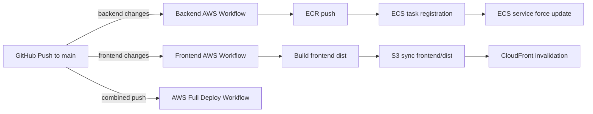

# AWS Setup and Deployment Guide

This guide explains how to configure AWS for this repository, how the AWS GitHub Actions workflows work, and how to connect frontend and backend deployment to AWS.

## Architecture Overview

The repo has two deployment targets for AWS:

- Backend: Docker image built from `backend-platform/services/auth-service/Dockerfile`, pushed to Amazon ECR, and deployed to Amazon ECS.
- Frontend: React/Vite app built from `frontend/`, output synced to an Amazon S3 bucket and optionally invalidates an Amazon CloudFront distribution.

A combined workflow is also available to run both backend and frontend deploys in a single GitHub Actions job.

### Deployment Flow



## Required AWS Resources

### Backend

- Amazon ECR repository
- Amazon ECS cluster
- Amazon ECS service
- IAM user or role with permissions to:
  - `ecr:GetAuthorizationToken`
  - `ecr:BatchCheckLayerAvailability`
  - `ecr:PutImage`
  - `ecr:InitiateLayerUpload`
  - `ecr:UploadLayerPart`
  - `ecr:CompleteLayerUpload`
  - `ecs:RegisterTaskDefinition`
  - `ecs:UpdateService`
  - `ecs:DescribeServices`

### Frontend

- Amazon S3 bucket for hosting
- Amazon CloudFront distribution (optional but recommended for CDN and cache invalidation)
- IAM permissions for S3 and CloudFront:
  - `s3:PutObject`
  - `s3:DeleteObject`
  - `s3:ListBucket`
  - `cloudfront:CreateInvalidation`

### Optional Kubernetes deployment

- Kubernetes cluster
- kubeconfig file for GitHub Actions secret
- Container registry to push images if using the repo's Kubernetes workflow

## GitHub Secrets

Add the following secrets to your repository settings:

- `AWS_ACCESS_KEY_ID`
- `AWS_SECRET_ACCESS_KEY`
- `AWS_REGION` (for example `us-east-1`)
- `ECR_REGISTRY` (example: `123456789012.dkr.ecr.us-east-1.amazonaws.com`)
- `ECR_REPOSITORY` (backend image repository name)
- `ECS_CLUSTER` (ECS cluster name)
- `ECS_SERVICE` (ECS service name)
- `S3_BUCKET` (frontend hosting bucket name)
- `CLOUDFRONT_DISTRIBUTION_ID` (optional, CloudFront distribution ID)
- `CONTAINER_REGISTRY` (optional for Kubernetes deployment)
- `CONTAINER_REPOSITORY` (optional for Kubernetes deployment)
- `KUBE_CONFIG` (optional for Kubernetes deployment, base64-encoded kubeconfig)

## AWS Setup Steps

### 1. Create IAM credentials

Create an IAM user for GitHub Actions with the minimum required permissions for ECR, ECS, S3, and CloudFront.

Use those credentials to populate:

- `AWS_ACCESS_KEY_ID`
- `AWS_SECRET_ACCESS_KEY`

### 2. Create ECR repository

1. Open the Amazon ECR console.
2. Create a repository for your backend image.
3. Store the registry URI in `ECR_REGISTRY`.
4. Store the repo name in `ECR_REPOSITORY`.

### 3. Create ECS cluster and service

1. Create or reuse an ECS cluster.
2. Create a service that uses a task definition.
3. Configure the service with your desired capacity and networking.
4. Store the cluster name in `ECS_CLUSTER` and the service name in `ECS_SERVICE`.

### 4. Configure S3 and optionally CloudFront

1. Create an S3 bucket for static hosting.
2. Optionally enable static website hosting or use CloudFront in front of the bucket.
3. Store the bucket name in `S3_BUCKET`.
4. If using CloudFront, store its distribution ID in `CLOUDFRONT_DISTRIBUTION_ID`.

### 5. (Optional) Configure Kubernetes access

1. Create or use an existing Kubernetes cluster.
2. Generate a kubeconfig that has access to the target cluster.
3. Base64-encode the kubeconfig and save it to GitHub secret `KUBE_CONFIG`:

```bash
base64 -w 0 ~/.kube/config
```

4. If using a container registry for Kubernetes images, store its values in:

- `CONTAINER_REGISTRY`
- `CONTAINER_REPOSITORY`

## Workflow Details

### `backend-aws.yml`

Path: `.github/workflows/backend-aws.yml`

What it does:

- Checks out the repo
- Configures AWS credentials
- Logs in to Amazon ECR
- Builds the backend Docker image using:
  - `backend-platform/services/auth-service/Dockerfile`
- Pushes the image to ECR
- Registers a new ECS task definition from `k8s/ecs-task-def-template.json`
- Forces a new ECS deployment on the configured cluster/service

Trigger:

- Push to `main`
- Changes under `backend-platform/**`, `services/**`, or the workflow file itself

### `frontend-aws.yml`

Path: `.github/workflows/frontend-aws.yml`

What it does:

- Checks out the repo
- Sets up Node.js 18
- Installs dependencies and builds the frontend in `frontend/`
- Configures AWS credentials
- Syncs `frontend/dist` to the configured S3 bucket
- Optionally creates a CloudFront invalidation if `CLOUDFRONT_DISTRIBUTION_ID` is set

Trigger:

- Push to `main`
- Changes under `frontend/**` or the workflow file itself

### `aws-deploy-all.yml`

Path: `.github/workflows/aws-deploy-all.yml`

What it does:

- Executes backend and frontend deploys in a single workflow run
- Reuses the same AWS credentials
- Builds the backend image, pushes it to ECR, and updates ECS
- Builds the frontend and syncs it to S3
- Invalidates CloudFront if configured

Trigger:

- Push to `main`
- Changes under `frontend/**`, `backend-platform/**`, `services/**`, or this workflow file

### `deploy-k8s.yml`

Path: `.github/workflows/deploy-k8s.yml`

What it does:

- Checks out the repo
- Sets up `kubectl`
- Writes the base64 `KUBE_CONFIG` secret to a kubeconfig file
- Optionally builds and pushes the backend image if `CONTAINER_REGISTRY` is set
- Replaces `__IMAGE_PLACEHOLDER__` in a Kubernetes deployment manifest
- Applies manifests using `kubectl apply -f k8s/`

Trigger:

- Push to `main`
- Changes under `k8s/**`, `backend-platform/**`, or the workflow file itself

## Important Repo Notes

- The repo currently contains Kubernetes manifests under `backend-platform/auth-service/`.
- The `deploy-k8s.yml` workflow expects manifests in `k8s/`.
- If you want to deploy to Kubernetes, either:
  - add a `k8s/` directory with the required manifests, or
  - update `deploy-k8s.yml` to point to the existing manifest location.

## Example Backend Task Definition Template

The ECS workflow uses `k8s/ecs-task-def-template.json` to register a task definition that is updated with the built image URI.

The template should contain a container definition like this:

```json
{
  "family": "my-backend-task",
  "containerDefinitions": [
    {
      "name": "auth-service",
      "image": "REPLACE_ME",
      "essential": true,
      "portMappings": [
        { "containerPort": 8080, "protocol": "tcp" }
      ]
    }
  ]
}
```

## Troubleshooting

- If the frontend does not deploy, verify `frontend/dist` exists after `npm run build`.
- If ECS deployment fails, verify the task definition JSON and ECS service names.
- If CloudFront invalidation fails, verify the distribution ID and IAM permissions.
- If Kubernetes deploy fails, verify `KUBE_CONFIG` is valid and the `k8s/` manifest path is correct.

## Summary

This repository supports:

- Backend AWS deployment via ECR + ECS
- Frontend AWS deployment via S3 + CloudFront
- Combined frontend/backend deploys in one workflow
- Optional Kubernetes deployment when manifests and kubeconfig are configured

Use `AWS_SETUP.md` as the reference for AWS environment setup, GitHub secret configuration, and workflow behavior.
